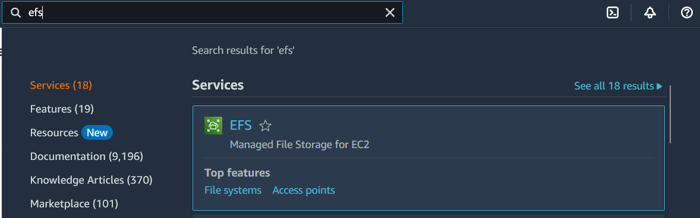
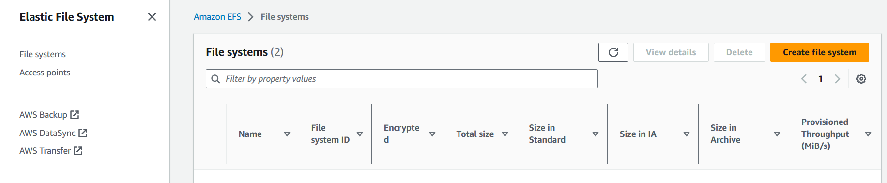
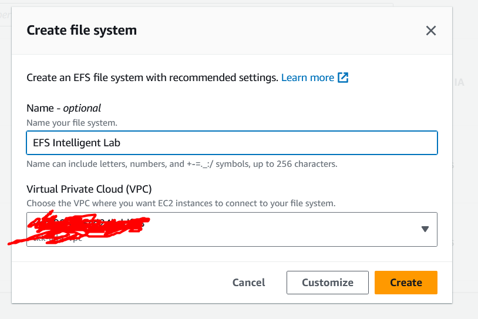
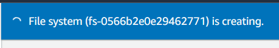
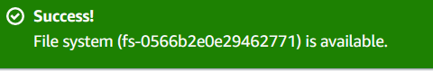
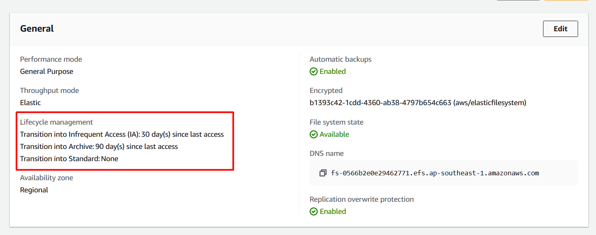
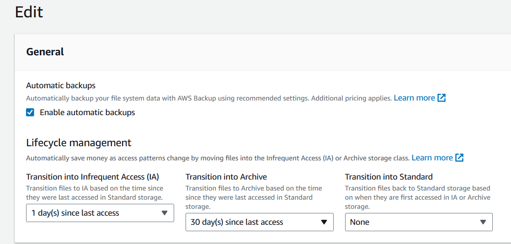
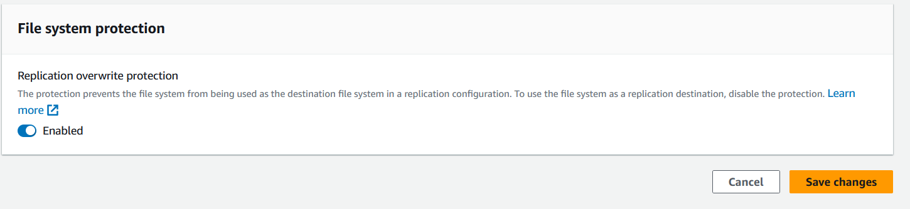

# Lab-How-To-Configure-EFS-Intelligent-Tiering

- Go to `EFS` from AWS Console

- Click `Create file system`

- Type `EFS Intellignet Lab` in `Name` and Click `Create`

- Wait until finished creation

- You will see like this and click `Edit`

- Select `1 day(s) since last access` at `Transition into infrequent Access (IA)

- Select `30 days(s) since last access` at Transition into Archive

- Click `Save Changes`

---
***Congratulations. You have completed Lab-How To Configure EFS Intelligent Tiering.***

---